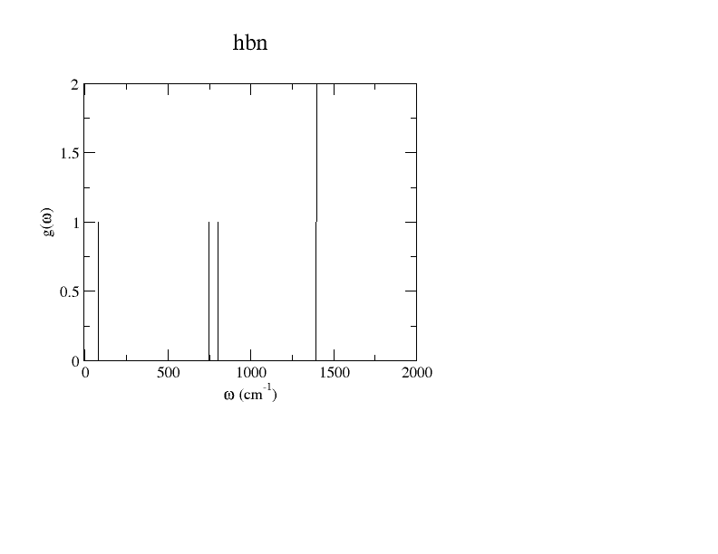
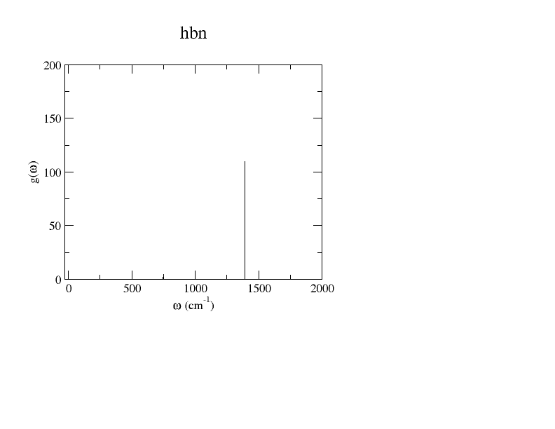
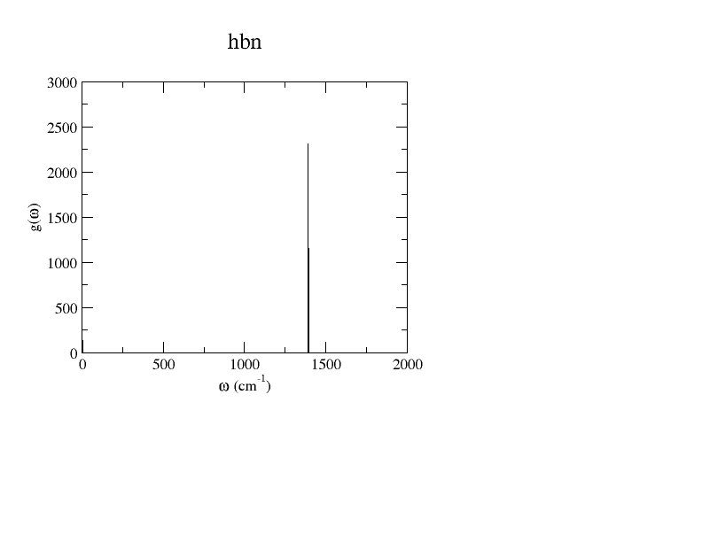
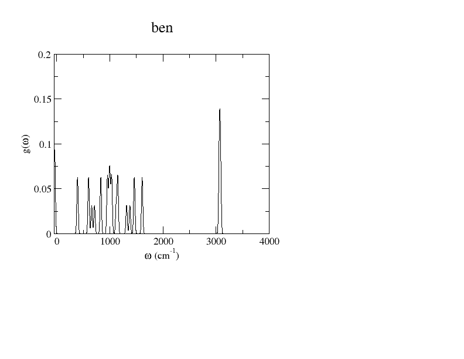
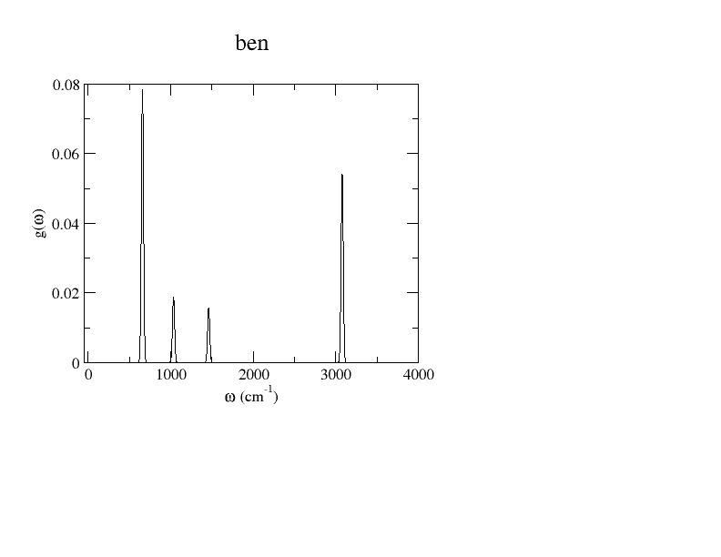
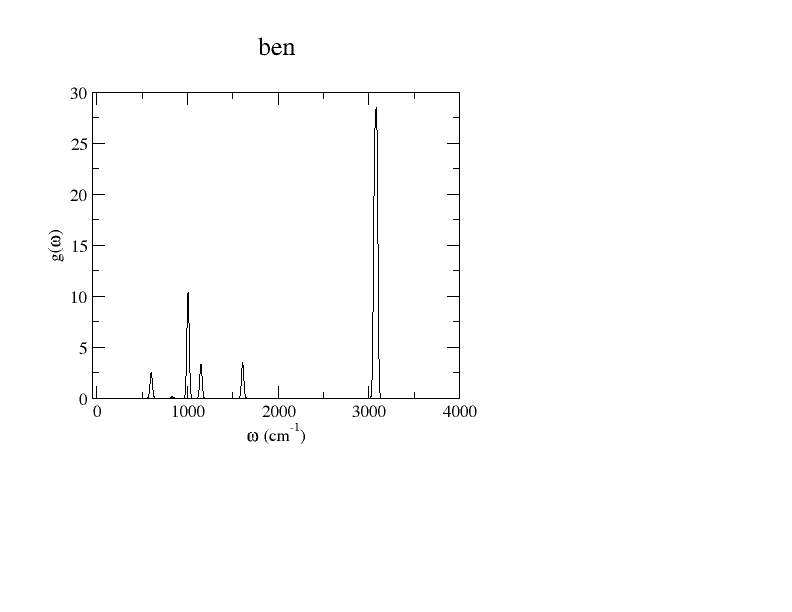

# Phonons and Spectroscopy

In this tutorial we will perform Castep phonon calculations. We will visually examine the vibrations and then examine, and compare to experiment, the IR and Raman spectra.

## G-point Phonon Spectrum of h-BN

We will first perform a G point phonon calculation and generate a simple model infrared spectrum of hexagonal boron nitride (h-BN). We will then visualise and analyse the results.

We will use the `cell` file

*hbn.cell*
```
%BLOCK LATTICE_ABC
2.500375 2.500375 6.635274
 90.0000000  90.0000000 120.0000000
%ENDBLOCK LATTICE_ABC

%BLOCK POSITIONS_FRAC
B       0.0000000   0.0000000   0.5000000
B       0.3333000   0.6667000   0.0000000
N       0.0000000   0.0000000   0.0000000
N       0.3333000   0.6667000   0.5000000
%ENDBLOCK POSITIONS_FRAC

SYMMETRY_GENERATE

%BLOCK SPECIES_POT
NCP
%ENDBLOCK SPECIES_POT

KPOINTS_MP_GRID 7 7 4
PHONON_KPOINT_MP_GRID 1 1 1
```

and the `param` file

*hbn.param*
```
task : PHONON
phonon_method : DFPT
xc_functional : LDA
opt_strategy : SPEED
cut_off_energy : 700.0 eV
fix_occupancy : TRUE
elec_method : DM
phonon_sum_rule : TRUE

CALCULATE_RAMAN : TRUE
RAMAN_METHOD: DFPT

```

A key point to make is that, as specified in the `cell` file, we are using the norm-conserving pseudopotentials (`NCP`) library - this is essential to allow the use the `DFPT` method, which allows calculations outside the cell without using a supercell - something that must be done for proper phonon calculations in a crystalline system.

The bottom 2 lines are to also calculate the Raman activity as well as IR. This makes the calculation take longer, and the phonon and IR calculations yield the same results, but this way you won't have to run the calculation a 2nd time when we look at those results later on in this tutorial.   

The line

`phonon_kpoint_mp_grid 1 1 1`

is used to specify that we are looking at the gamma-point phonon wavevector.

Once the files are set up, run Castep

!!! note
    Phonon calculations can take a while, so it is recommended to use multiple cores if possible

This generates 2 files in which we are interested: the standard `hbn.castep` output and `hbn.phonon` for phonons specifically. Let's first look at `hbn.castep`.

All the data relevant to the phonon calculations is found under the header

```
==============================================================================
+                           Vibrational Frequencies                          +
+                           -----------------------                          +
```

and, since we are only looking at the gamma point, all our results are under

```
+ -------------------------------------------------------------------------- +
+  q-pt=    1 (  0.000000  0.000000  0.000000)     1.0000000000              +
+ ---------------------------------------------------------------------------
```

The main table of results relevant to this tutorial is this

<a id="vib_table"></a>

```
+  Acoustic sum rule correction <  40.683968 cm-1 applied                    +
+     N      Frequency irrep.    ir intensity active  raman activity  active +
+                (cm-1)         ((D/A)**2/amu)              (A**4/amu)       +
+                                                                            +
+     1      -0.049167   a          0.0000000  N            0.0000000  N     +
+     2      -0.034768   b          0.0000000  N            0.0000000  N     +
+     3      -0.034768   b          0.0000000  N            0.0000000  N     +
+     4       5.884970   c          0.0000000  N            0.0027626  Y     +
+     5       5.884970   c          0.0000000  N            0.0027626  Y     +
+     6      79.102129   d          0.0000000  N            0.0000000  N     +
+     7     748.397652   a          4.3158435  Y            0.0000000  N     +
+     8     802.377724   d          0.0000000  N            0.0000000  N     +
+     9    1392.655948   c          0.0000000  N          387.2810248  Y     +
+    10    1392.655948   c          0.0000000  N          387.2810248  Y     +
+    11    1393.029830   b         54.7195502  Y            0.0000000  N     +
+    12    1393.029830   b         54.7195502  Y            0.0000000  N    
```

The frequencies are the frequencies of all the phonon modes. Note modes 3, 4 and 5 - these are all close to 0, indicating that they are the acoustic modes (we will understand what this means better once we visualise it in the next step). The "negative" frequencies aren't actually negative but rather imaginary - this means that, when calculated, the vibrational hamiltonian is not a definite positive value, and thus the distortion would stabilise the structure - this corresponds to a mechanical instability in the system.

Each phonon frequency is then evaluated as to whether it is IR and/or Raman active, and, for IR only for now, the relative intensity of the IR activity.

Let's take a quick look at the `hbn.phonon` output. It will include the cell structure information in the header, the same data as in the table above, and then phonon eigenvectors for each mode and ion - that table starts a bit like

```
Mode Ion                X                                   Y                                   Z
   1   1 -0.186110205437  0.000000000000      0.428278409589  0.000000000000     -0.000000000000  0.000000000000
   1   2  0.186110205437  0.000000000000     -0.428278409589  0.000000000000     -0.000000000000  0.000000000000
   1   3  0.211622374796  0.000000000000     -0.486987233712  0.000000000000     -0.000000000000  0.000000000000
   1   4 -0.211622374796  0.000000000000      0.486987233711  0.000000000000     -0.000000000000  0.000000000000
   2   1 -0.428278409589  0.000000000000     -0.186110205437  0.000000000000      0.000000000000 -0.000000000000
```


### Analysis of h-BN phonon output.

We will now visualise the `phonon` output using JMOL. To see how the ions actually move in the different modes:

1. In the JMOL console, use the command `LOAD hbn.phonon {3 3 2} PACKED` - changing any paths as appropriate. This generates a 3x3x2 supercell, which makes it a bit easier to see what's going on
2. Fix the unit cell using the command `"UNITCELL "a=2.5,b=2.5,c=6.635,alpha=90,beta=90,gamma=120"` - this prevents the structure from collapsing when viewing the vibrations.
3. In the menu bar, go into `Tools -> Vibrate... -> Start vibration`.
4. From then on, you can conveniently alternate between modes by clicking the arrows at the top of the screen (just below the menu bar). In the bottom-left of the screen, it tells you the details of the mode you are viewing.
Gifs of the resulting vibrations are embedded below.


<html>
    <style>
        .arrow-button {
            font-size: 24px;
            padding: 10px 20px;
            cursor: pointer;
        }
        .arrow-button:disabled {
            background-color: #d0d0d0;
            cursor: not-allowed;
        }
        }
    </style>

<body>

    <button id="left-button" class="arrow-button" onclick="decrement()">&#8592;</button>
    <button id="right-button" class="arrow-button" onclick="increment()">&#8594;</button>

    <div id="display">Mode 1</div>
    <div id="image-container">

        
    </div>

    <script>
        let x = 1;

        function updateButtons() {
            document.getElementById('left-button').disabled = (x <= 1);
            document.getElementById('right-button').disabled = (x >= 12);
        }

        function updateImage() {
            const img = document.getElementById('mode-image');
            img.src = `../mode_${x}.gif`;
            img.alt = `Mode ${x}`;
        }

        function increment() {
            if (x < 12) {
                x++;
                document.getElementById('display').textContent = `Mode  ${x}`;
                updateButtons();
                updateImage();
            }
        }

        function decrement() {
            if (x > 1) {
                x--;
                document.getElementById('display').textContent = `Mode ${x}`;
                updateButtons();
                updateImage();
            }
        }

        // Initial button state and image update
        updateButtons();
        updateImage();
    </script>

</body>
</html>

We can see the link between visual results to what we saw in the `phonon` and `castep` files. You can vaguely see how modes 1 and 2 appear as if they are trying to shift into another lattice. Modes 3, 4 and 5 don't contain any atoms moving relative to each other (every part of the crystal is moving together), which is what's expected of optical modes (hence the near-zero frequency). One can even see how 7 and 8 are similar to each other visually (corresponding to a similar frequency), as are 9, 10, 11 and 12.

### Visualising the Spectra

We will now look at how to visualise the phonon DOS, IR and Raman spectra. dos.pl is a convenient tool to do so, and in this tutorial we will use it with xmgrace. To visualise the full phonon DOS, run the command

`dos.pl -xg hbn.phonon`

This gives the xmgrace figure

{width="70%"}

This gives us the same information as in the vibrational frequency table [above](#vib_table) - there are a total of 5 peaks (including the one that appears as if it is on 0 - it isn't actually on 0, just very close to it: it is just below 6cm^-1^), and in there are 5 noticeably different, positive and real mode frequencies.

Now let's run the command

`dos.pl -ir -xg hbn.phonon`

The `-ir` keyword displays the infrared spectra. This will open an xmgrace figure that looks like

{width="70%"}


As expected, you can see 1 large peak and 1 very small one - there are 3 IR active modes in total, 2 of which have the same frequency and 1 of which has a much lower intensity. Both the peaks are in the same positions as the phonon DOS above, but there is now a calculated intensity (rather than just flat number of modes at that frequency) and only the IR active ones are displayed.

We can similarly look at the Raman spectrum by replacing `-ir` with `-raman` - this gives the following output:

{width="70%"}

There are 4 Raman active modes, 2 of which have negligible intensity, and the 2 others have identical frequencies, so only one peak is seen. The intensities of the 2 results are different, but that doesn't matter as only relative intensities have any physical meaning in this case; the intensities have to be adjusted to simulate experiment regardless.

In the end, the Raman spectra had a decent match to experiment^[[1](#1)]^, finding a single peak around 1397cm^-1^, compared to 1373cm^-1^ in experiment. The FTIR results match more poorly - the 2 active frequencies are rather similar, at 747cm^-1^ and 1397cm^-1^ in our calculation, and 790cm^-1^ and 1378cm^-1^ in experiment, but there the relative intensities are much closer together than we found^[[2](#2)]^, so the infrared spectrum looks quite a bit different.

## B. Molecular modes in benzene

We will now look at the phonon DOS, IR and Raman spectra for a more interesting example - benzene. We will use the `cell` file

*ben.cell*
```
%BLOCK lattice_cart
   ANG
       8.60643301684681       0.111339687610194E-33    0.00000000000000
      -4.30321650842340        7.50045743714604        0.00000000000000
       0.00000000000000        0.00000000000000        9.24037398197401
%ENDBLOCK lattice_cart
%BLOCK positions_frac
   H              0.165372872629966       0.330745745259933       0.000000000000000
   H              0.332641698874813       0.165581276354313       0.000000000000000
   H              0.832939577479499       0.165581276354313       0.000000000000000
   H              0.167047254520501       0.834392387645687       0.000000000000000
   H              0.667345133125187       0.834392387645687       0.000000000000000
   H              0.834613959370034       0.669227918740067       0.000000000000000
   C              0.092519552491022       0.185039104982044      -0.000000000000000
   C              0.186182139723987       0.092587628215135       0.000000000000000
   C              0.906405834602259       0.092587628215135       0.000000000000000
   C              0.093580997397742       0.907386035784866      -0.000000000000000
   C              0.813805038387124       0.907386035784866      -0.000000000000000
   C              0.907467279508978       0.814934559017956       0.000000000000000
%ENDBLOCK positions_frac
PHONON_KPOINT_MP_GRID 1 1 1
FIX_COM : true
FIX_ALL_CELL : TRUE
%BLOCK species_pot
NCP
%ENDBLOCK species_pot
SYMMETRY_TOL :     0.001000
kpoint_mp_grid :    1   1   1
```

and the `param` file

*ben.param*
```
task : PHONON
xc_functional : LDA
opt_strategy : SPEED
cut_off_energy : 700.0 eV
fix_occupancy : TRUE
elec_method : DM
phonon_sum_rule : TRUE


CALCULATE_RAMAN : TRUE
RAMAN_METHOD: DFPT
```

We are again only looking at the G-point; there is no electronic dispersion in a molecule so it'd be pointless to have look at multiple q-points. Since we are looking at just a single molecule, the lattice size is set to a size where periodic interaction is negligible - making it larger may improve the results slightly but then the speed of the calculation would suffer greatly. The symmetry of the cell is naturally hexagonal.

For simplicity we are using the local density approximation, and the standard NCP library pseudopotentials.

After running Castep, have a quick look at the `.phonon` or `.castep` output file again. The key difference is that there are now 36 modes. This is entirely expected: the number of modes is equal to 3 * the number of atoms in the primitive cell, and benzene (C~6~H~6~) has 12 atoms. This time, the first 3 modes have an imaginary frequency (displayed as negative), and modes 4, 5 and 6 correspond to the acoustic modes.

With more modes, you can get a better picture of the phonon DOS by plotting it with the keyword `-w 30` using the same `dos.pl` keyword as above - this adds some realistic broadening. This gives the figure below:

{width="70%"}

The broadened IR spectrum is obtained the same way, and is shown below:

{width="70%"}

and the Raman spectrum looks like

{width="70%"}

You may compare the IR results to that in the [NIST Database](https://webbook.nist.gov/cgi/inchi?ID=C71432&Type=IR-SPEC&Index=1#IR-SPEC) - it is rather similar, though the broadening fails to properly simulate experiment, and it is missing the small peaks between 1500 and 2000cm^-1^. It is worth noting that these calculations are ground state - the results will naturally vary when there is pressure and temperature involved, since vibrations are being examined.


Are all your frequencies positive? If not, can you suggest why not? Try
investigating the effect of decreasing the geometry optimisation
tolerance GEOM_FORCE_TOL. How does this change the frequencies?

## References

<a id="1"></a>
[1] - [Record-High Responsivity and Detectivity of a Flexible Deep-Ultraviolet Photodetector Based on Solid State-Assisted Synthesized hBN Nanosheets](https://doi.org/10.1021/acsaelm.0c01021)

<a id="2"></a>
[2] - [A fexible memory device made of SnO2‑hBN
nanocomposite exhibits stable resistive switching
application](https://doi.org/10.1007/s10853-024-09976-9)


Benzene Phase III: The next stage is to compute the gamma point phonon
modes of the molecular crystal of benzene in the high pressure
polymorph, Phase III. You are supplied with a .cif file. You should use
a 2x2x2 grid of electronic k-points, as dispersion is non-zero in this
molecular crystal. Make sure that symmetry is detected and enabled. Use
the same .param file as for the molecular case to ensure the settings
are the same.
